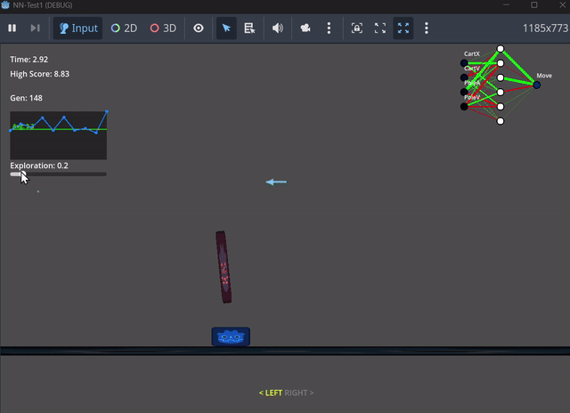
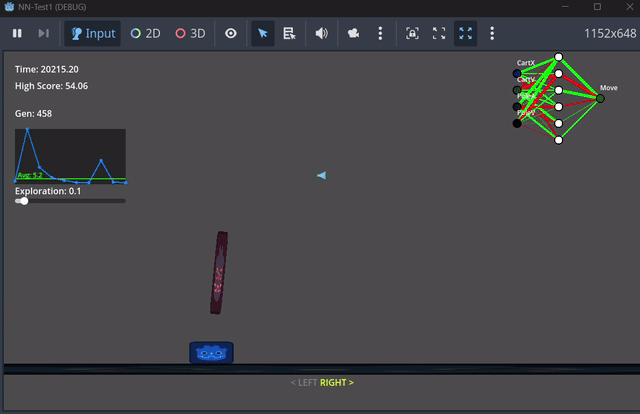

# Pole and Cart - Godot Neural Networking Playground

A simple evolutionary neural network used with the 'pole and cart' self-balancing problem, implemented in Godot.

The agent controls a cart with a pole attached to it. The pole can tip forward or backward, and the cart can move left or right to counteract it.  The agent's goal is to keep the pole balanced on top of the cart without tipping over or leaving the screen.  It repeats this process with mild mutations to its reaction algorithm, updating the base parameters each time they are discovered to lead to longer survival.

Mild 'wind' is applied to the pole to prevent the agent from applying the War Games solution.

The wind, along with the state of the network parameters, the performance history, and the agent's real-time reactions are represented on screen during training.

### generation ~200



### generation ~1000



Several hundred generations passed before progress became meaningful, though the agent ultimately seemed to solve the problem, balancing for over 5 hours before I stopped it manually.  I've since increased the wind to become a more formidable obstacle.

While I initially considered the agent to be laughably slow in progress, I realized in hindsight that the problem was much harder in this implementation than I intended.  The agent only has three choices: apply force to the left, apply force to the right, or do nothing.  Importantly, that force is discrete rather than continuous, and so the agent learned to pulse its force application to carefully counteract the pole's tip while avoiding the accumulation of excessive momentum and overcorrecting.  Furthermore, the agent was not fed its own previous decision or the history of its state, and so it would be difficult for it to infer tick-to-tick where it was in the force-pulsing cycle.

---

## Scripts Overview

### 1) Define matrix operations with `scripts/math/matrix.gd`

The Godot engine has some built in matrix math, but not for arbitrary dimensions.  As such, doing the vectorized math for activations in a given layer of a neural network, i.e.,
$$a_i = \phi(Wa_{i-1} + b),$$
$$a_i = \text{activation vector}$$

$$\phi = \text{activation function}$$

$$W=  \text{weight matrix}$$

$$b_i=  \text{bias vector}$$

is unsupported.  There's a "MatrixCalc" addon in the Asset Library which seems to perform the relevant operations on a compute shader, but I don't feel like messing with that at this stage.

The functions used here are named for the appropriate matrix math operations, but under-the-hood they're just for-loops.

Tanh is chosen as an appropriate activation function simply because its range conveniently maps to the cart controller's intended input range of [-1, 1].  The same activation is applied to the hidden layer activations as well for simplicity.  It is nice that tanh is smooth and differentiable in case backpropagation is desired in the future, though it is not implemented here.

```gdscript
func dot(a: Array[float], b: Array[float]) -> float:
    '''Determine the dot product of two vectors (for multiplying the weight matrix and the activation vector)'''

func add(other: Array[float]) -> Array[float]:
    '''Add another matrix to current matrix (for adding biases to activations)'''

func map(func_ref: Callable) -> Array[float]:
    '''Applies a function to each element of the matrix (for activation functions on each activation)'''

func tanh(x: float) -> float:
    '''Activation function to smoothly compress output to [-1, 1]'''
```

### 2) Define network operations with `scripts/ai/neural_network.gd`

In an evolutionary algorithm, the best-performing network is copied to the next generation with a random mutation applied to it (in the form of gentle nudges to the weights and biases).  

There's no method here for estimating fitness or cost, and so these mutations must be random—though their rate (how many parameters are nudged) and magnitude (how much each parameter is nudged) can be adjusted in the code to balance training speed and performance.

```gdscript
func forward(input_array: Array) -> Array:
 '''Forward pass through the network (input what the model is allowed to see and output the model's decision/reaction)'''

func mutate(rate: float):
 '''Nudge weights and biases between generations'''

func save(path: String):
 '''Save parameters to file (for storing the current best-performing network)'''

func load_network(path: String) -> NeuralNetwork:
 '''Load parameters from file (for loading the current best-performing network)'''
```

### 3) Train agent with `scripts/ai/agent_neuro.gd`

The agent controls a cart with a pole attached to it.  The cart can move left or right, and the pole can tip forward or backward.  The goal is to keep the pole balanced on top of the cart.

- topology:
  - 4 x inputs (cart position, cart velocity, pole angle, pole velocity)
  - 6 x hidden
  - 1 x output (tanh: -1 left, 1 right)
- algorithm: 1+1 Evolution Strategy
  - mutation rate: 0.2
  - mutation magnitude: 0.1

```gdscript
func _ready():
 var topology: Array[int] = [4, 6, 1]
    best_network = NeuralNetwork.load_network(save_path)
    current_network = best_network.copy()

var inputs_normalized = [
    clamp(cart.position.x / 600.0, -1.0, 1.0),
    clamp(cart.linear_velocity.x / 1000.0, -1.0, 1.0),
    clamp(pole.rotation / 1.0, -1.0, 1.0), # ~60 deg is 1.0
    clamp(pole.angular_velocity / 5.0, -1.0, 1.0)
]
 
var output = current_network.forward(inputs_normalized)
cart.ai_input = output[0] # -1 to 1

func evaluate_fitness(fitness: float):
 if fitness > best_fitness:
  best_fitness = fitness
  best_network = current_network.copy()
  best_network.save(save_path)
  print("New Best! Saved.")
 
 current_network = best_network.copy()
 current_network.mutate(0.2, 0.1) # Rate, Magnitude
 generation += 1

func _process(delta):
 if game_manager.is_game_over:
  evaluate_fitness(game_manager.time_elapsed)
  game_manager.reset_game()

```

### 4) Cart Controller with `scripts/cart_controller.gd`

```gdscript
extends RigidBody2D

@export var speed: float = 2000.0

func _physics_process(delta):
    if ai_input < -0.3:
        force.x = -speed
    apply_force(force)
```

### 5) Misc

#### 5a) Manage game state with `game_manager.gd`

- Manage other scripts (update UI, handle game over, etc.)
- Add noise to pole tilt force
  - very light, slow background noise to prevent the model from perfectly balancing the pole
  - used FastNoiseLite for coherence and randi() to seed it to prevent training from accomodating the noise
  - also uses `visuals/wind_visualizer.gd` to make a little particle effect and arrow to illustrate the effect of the noise

#### 5b) Network Topology Visualizer with `scripts/ai/network_visualizer.gd`

- inputs and outputs are labeled
- activation of each node is represented with color: black (0), green (+), and red (-)
- weight magnitudes are represented with thickness and their sign is represented with color: green (+), red (-)
- biases are excluded for simplicity (I'm sure there's a nice way people represent them somehow)

#### 5c) Arrows with `scripts/ui.gd`

- the agent's input options (move left, move right) light up when the corresponding choice is selected

#### 5d) History Graph with `scripts/ai/history_graph.gd`

- graph shows the last 10 generations of fitness

---

## resources

- Unity official [ML-Agents repo](https://github.com/Unity-Technologies/ml-agents)

---

## to do

- fixes
  - save parameters of new best before it fails, or at least print them at start of new generation (some generations last longer than I care to wait, which is functionally perfect given the lack of calculating any cost)
  - make wind particles look good
- improve algorithm
  - 1+1 ES is slow and doesn't explore the possibility space effectively "\[d\]ue to its single-solution nature and simple mutation operator"
