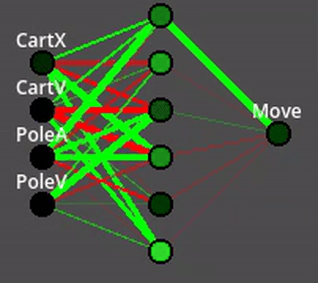
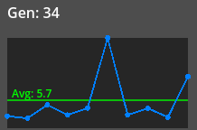
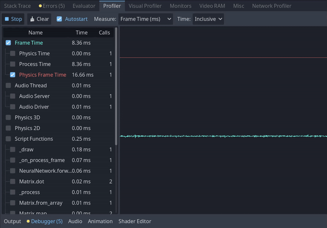

# Genetic Mutation Self-Balancing in Godot

A simple evolutionary neural network approach to the 'pole and cart' self-balancing problem, implemented in Godot.

---

## Overview

The agent controls a cart with a pole attached to it. The pole can tip forward or backward, and the cart can move left or right to counteract it.  The agent's goal is to keep the pole balanced on top of the cart without tipping over or leaving the screen.  It repeats this process with mild mutations to its reaction algorithm, updating the base parameters each time they are found to lead to longer survival.

Mild 'wind' is applied to the pole to prevent the agent from discovering the War Games solution.

The wind, along with the state of the network parameters, the performance history, and the agent's real-time reactions are represented on screen during training, alongside a few interactive controls to influence the training if desired.

### Generation ~200


### Generation ~1000


- *note that the 'generation' counter resets on relaunching the game even though the best parameters persist, so the counters in the gifs are inaccurate*

Several hundred generations passed before progress became meaningful, though the agent ultimately seemed to solve the problem, balancing for over 5 hours before I stopped it manually.  I've since increased the wind to become a more formidable obstacle.

While I initially considered the agent to be laughably slow in progress, I realized in hindsight that the problem was much harder in this implementation than I intended.  The agent only has three choices: apply force to the left, apply force to the right, or do nothing.  Importantly, that force is discrete rather than continuous, and so the agent learned to pulse its force application to carefully counteract the pole's tilt, while simultaneously avoiding the accumulation of excessive momentum in the opposite direction.  Furthermore, the agent was not fed its own previous decision or the history of its state, and so to infer a place in the force-pulsing cycle tick-to-tick is impressive.

---

## Scripts Description

### 1) Define matrix operations with `scripts/math/matrix.gd`

The Godot engine has some built in matrix math, but not for arbitrary dimensions.  As such, doing the vectorized math for activations in a given layer of a neural network, i.e.,

$$a_i = \phi(Wa_{i-1} + b),$$

$$a_i = \text{activation vector}$$

$$\phi = \text{activation function}$$

$$W=  \text{weight matrix}$$

$$b_i=  \text{bias vector}$$

is unsupported.  There's a "MatrixCalc" addon in the Asset Library which seems to perform the relevant operations on a compute shader, but I don't feel like messing with that at this stage.

Some of the functions here are named to reflect vectorized matrix operations, but they are all loops under-the-hood.

```gdscript
func dot(a: Array[float], b: Array[float]) -> float:
    '''Determine the dot product of two vectors (for multiplying the weight matrix and the activation vector)'''

func add(other: Array[float]) -> Array[float]:
    '''Add another matrix to current matrix (for adding biases to activations)'''

func map(func_ref: Callable) -> Array[float]:
    '''Applies a function to each element of the matrix (for activation functions on each activation)'''

func tanh(x: float) -> float:
    '''Activation function to smoothly compress output to [-1, 1]'''
```

Tanh was chosen as an activation function simply because its range conveniently maps to the cart controller's intended input range of [-1, 1].  For simplicity, the same activation is applied to the hidden layer activations as well.  It is nice that tanh is smooth and differentiable in case backpropagation becomes desirable, though it is not implemented here.


### 2) Define network operations with `scripts/ai/neural_network.gd`

In an evolutionary algorithm, the best-performing network is copied to the next generation with a random mutation applied to it (in the form of gentle nudges to the weights and biases).  

There's no method here for estimating fitness or cost, and so these mutations must be random.  The rate (the likelihood for each parameter to be nudged) and magnitude (how far they are nudged) can be modified in the code to allow the algorithm to explore the parameter space more or less aggressively.

```gdscript
func forward(input_array: Array) -> Array:
 '''Forward pass through the network (input game state, process it, output reaction)'''

func mutate(rate: float):
 '''Nudge weights and biases between generations at a given mutation rate and magnitude'''

func save(path: String):
 '''Save current best-performing network parameters to local storage'''

func load_network(path: String) -> NeuralNetwork:
 '''Load best-performing network parameters from local storage (initialize a network if no file is found)'''
```

The 'current best' parameters are saved to a .json with the following structure:

```json
{
    "generation_number": 1,
    "child_number": 1,
    "best_time": 0.0,
    "sizes": [4, 6, 1],
    "weights": [
        [1.5, -2.0, 8.0, -0.5],
        [2.5, 2.0, -1.0, 5.5]
    ],
    "biases": [
        [-5.0, 5.0, 2.4, 4.9, -0.5, 0.7],
        [3.1]
    ]
}
```

The script uses the persistent user data directory, `user://` ([docs](https://docs.godotengine.org/en/stable/tutorials/io/data_paths.html#accessing-persistent-user-data-user)), to save and load the parameters.  For me on Windows, this places the file at `C:\Users\me\AppData\Roaming\Godot\userdata\user\best_ai_v2.json`.

An example high-performing network (capable of surviving >10 min) is included in the `export` directory, `best_ai_v2.json`, for reference.  To use it, copy the file into your `user://` directory.  To reset generation progress, delete the save file (from `user://`, not `export`) and run the game.

### 3) Train agent with `scripts/ai/agent_neuro.gd`

The agent's aim is to keep the pole balanced on top of the cart.  It does this by applying force to the cart to counteract the pole's tilt.  This force is determined by processing the cart's position and velocity, and the pole's angle and velocity at each frame, with a single six-node hidden layer.  In summary, the network topology is as follows:

- 4 x inputs (cart position, cart velocity, pole angle, pole velocity)
- 6 x hidden
- 1 x output (force)


- *visualizer code found in scripts/ai/net_visualizer.gd*

The fitness at each generation is determined by the amount of time before the pole falls off the cart or the cart leaves the screen.  In this implementation, there is no cost determination or reward signal, and so the agent simply explores the parameter space through random mutations.  Once a network achieves a fitness exceeding the previous best, it is saved to a file and used as the starting point for the next generation.

- *Note that 'generation' here refers to the set of networks that has yet to surprass the previous best.  The 'child' of a generation is the final network of that generation, which is used as the starting point for the next.*

After evaluating fitness, the game is reset.

```gdscript
func _ready():
 var topology: Array[int] = [4, 6, 1]
    best_network = NeuralNetwork.load_network(save_path)
    current_network = best_network.copy()

var inputs_normalized = [
    clamp(cart.position.x / 600.0, -1.0, 1.0),
    clamp(cart.linear_velocity.x / 1000.0, -1.0, 1.0),
    clamp(pole.rotation / 1.0, -1.0, 1.0), # ~60 deg is 1.0
    clamp(pole.angular_velocity / 5.0, -1.0, 1.0)
]
 
var output = current_network.forward(inputs_normalized)
cart.ai_input = output[0] # -1 to 1

func evaluate_fitness(fitness: float):
 if fitness > best_fitness:
  best_fitness = fitness
  best_network = current_network.copy()
  best_network.save(save_path)
  print("New Best! Saved.")
 
 current_network = best_network.copy()
 current_network.mutate(0.2, 0.1) # Rate, Magnitude
 generation += 1

func _process(delta):
 if game_manager.is_game_over:
  evaluate_fitness(game_manager.time_elapsed)
  game_manager.reset_game()

```

The cart's position is considered 0 at the center of the screen to match the symmetry of its fail condition (moving off the screen) with the pole's fail condition (tilting off the cart). 

### 4) Cart Controller with `scripts/cart_controller.gd`

The agent's decision, a value from -1 to 1, is split into three discrete states — left, right, or nothing — applied to cart's horizontal force as a Godot RigidBody through its `apply_force` method.

```gdscript
extends RigidBody2D

@export var speed: float = 2000.0

func _physics_process(delta):
    if ai_input < -0.3:
        force.x = -speed
    apply_force(force)
```

This discretization method is perhaps the most realistic in reflecting the abilities of a mouse-and-keyboard user, but, as noted in the introduction, it likely adds drastic complexity to the problem. When I imagined this problem with continuous force application, I figured that the computer would reach what felt like the obvious solution where the force application decision was basically just anti-proportional to the tilt of the pole. Something a human would code deterministically with something like a PID algorithm.

With discrete force application, the model must 'pulse' its inputs to temper the counter-force and avoid overcorrecting to failure.

### 5) Misc

#### 5a) Manage game state with `game_manager.gd`

Update UI, handle failure/resetting, and add noise to the pole tilt force.

```gdscript
func setup_ui():
	'''Create labels, graphs, and mutation sliders'''

func update_stats(history: Array, gen: int):
    '''Update labels and graphs'''

func _physics_process(delta):
    '''Apply wind force to pole'''

func _process(delta):
    '''Check for failure and reset if necessary'''

    if high_score > 0 and time_elapsed > high_score + 10.0:
        game_over()
```


The wind noise started as very mild, low-frequency oscillations to the pole tilt force to prevent the model from perfectly balancing the pole (though it has been intensified to challenge the more successful generations).  It uses FastNoiseLite for coherence and randi() to seed it to prevent training from accomodating the noise.  It also uses `visuals/wind_visualizer.gd` to make a little particle effect and arrow to illustrate the effect of the noise

A forced reset is also implemented here once the agent exceeds the high score by 10 seconds to avoid cases where the agent effectively solves the problem, but never records its parameters because the saving only happens on failure.

#### 5b) Network Activations Visualizer with `scripts/ai/net_visualizer.gd`

A neural network topology visualizer that shows the network's structure and the activations of its nodes in real time as the agent plays.  

Input and output nodes are labeled, and all node activations are represented with changing colors: black (0), green (+), and red (-).  Weight magnitudes are represented with thickness and their sign is represented with color: green (+), red (-).

```gdscript
func update_network(net: NeuralNetwork, inputs: Array, outputs: Array):
	'''Accept updated network information from the agent script'''

func _draw():
	'''Calculate node positions, draw and label nodes and edges, change node colors based on activation and edge color/thickness based on weight'''
```

Biases are excluded for simplicity, though I'm sure there's a nice way to represent them without appearing overcomplicated.

#### 5c) Arrows with `scripts/visuals/ui_manager.gd`

The agent's input options (move left, move right) light up when the corresponding choice is selected


```gdscript
func _process(delta):
	'''Modulate left/right arrow color based on agent's active decision'''
```

#### 5d) Performance History Visualizer with `scripts/ui/performance_graph.gd`

A performance history visualizer that illustrates the last 10 generations of fitness, as well as the overall average.



```gdscript
func _ready():
	custom_minimum_size = Vector2(graph_width, graph_height)

func _draw():
	'''Determine scale, draw background, polyline, and average'''
```
---

## resources

- Unity official [ML-Agents repo](https://github.com/Unity-Technologies/ml-agents)

- Evolution Strategy [wiki](https://en.wikipedia.org/wiki/Evolution_strategy)

- current 'looping gif' mp4 snip converter ffmpeg commands:

create palette from mp4
```bash
ffmpeg -ss 00:00:00 -to 00:00:10 -i input.mp4 -vf "fps=15,scale=640:-1:flags=lanczos,palettegen" palette.png
```
create gif from palette and mp4 (10 sec, 15 fps, looping)
```bash
ffmpeg -ss 00:00:00 -to 00:00:10 -i input.mp4 -i palette.png -filter_complex "fps=15,scale=640:-1:flags=lanczos,paletteuse" -loop 0 output.gif
```

---

## to do

- readme
  - [ ] take new gifs of the 0 gen vs current best
  - [ ] revisit the math and verify it properly reflects the scripts (probably refactor the "matrix" math)
- fixes
  - [ ]save parameters of new best before it fails, or at least print them at start of new generation (some generations last longer than I care to wait, which is functionally perfect given the lack of calculating any cost)
  - extend pole sprite to touch cart without incurring collider warnings
  - [x] get wind direction arrow head to start at tip of line
  - [ ] do I want the wind to affect just the pole instead of the cart?
  - [ ] instead of resetting game after surpassing best by the threshold time, just save the network and continue training
    - [x] add a button to reset the game
- improve algorithm
  - 1+1 ES is slow and doesn't explore the possibility space effectively "due to its single-solution nature and simple mutation operator"
  - should be easy-ish to increment complexity with parents and/or offspring strategies ($\mu + \lambda$)
- [x] report profiler information for using the network frame to frame
  - [ ]consider evaluating the effectiveness of the network when its reaction is inferred every other frame
- make it more fun to engage with
  - make wind particles look good
  - music
    - [x] trudging/ceaseless
    - [ ] triumphant undertones emerging as the time increases
  - [x] sound fx
    - [ ] wind gusts proportionate to the wind magnitude and stereo panning
    - [ ] fanfare when the agent exceeds the high score

