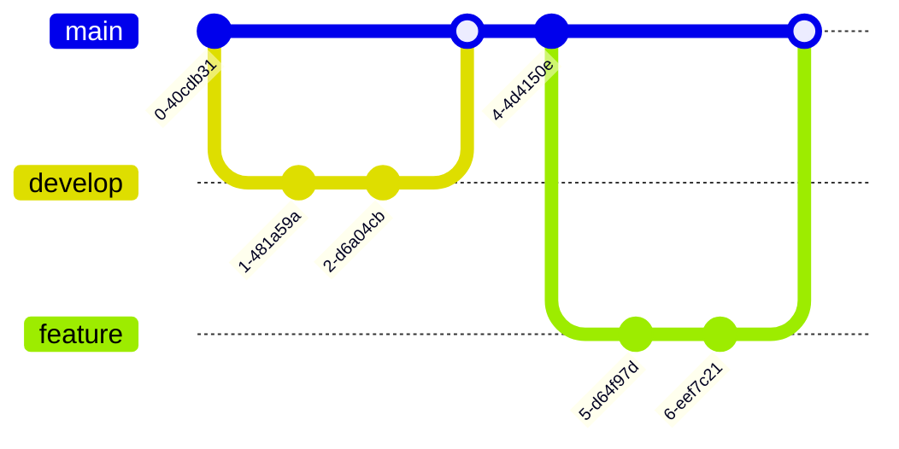

# Pole and Cart - Godot Neural Networking Playground

simple mutation genetic network test using the 'pole and cart' self-balancing problem, implemented in Godot

### generation ~200


### generation ~1000


## Overview

### Define matrix behavior (+ activation functions) with `scripts/math/matrix.gd`

probably better to use the built-in matrix math ([docs](https://docs.godotengine.org/en/stable/tutorials/math/vector_math.html)), but Gemini wanted to build its own Matrix class, so that's cool

```gdscript
func _init(p_rows: int, p_cols: int, fill: float = 0.0):
	'''Initialize new matrix'''

func random(p_rows: int, p_cols: int) -> Matrix:
    '''Randomize elements of input matrix -1.0 to 1.0'''

func dot(a: Matrix, b: Matrix) -> Matrix:
    '''Perform matrix multiplication (dot product) between input matrices'''

func add(other: Matrix) -> Matrix:
    '''Add another matrix to current matrix'''

func map(func_ref: Callable) -> Matrix:
    '''Applies a function to each element of the matrix (enables element-wise operations like activation functions)'''

func tanh(x: float) -> float:
    '''Smoothly compress output to [-1, 1] for activation functions'''
```

### Define network properties with `scripts/ai/neural_network.gd`

```gdscript
func _init(sizes: Array[int]):
	'''Initialize new network'''
	layer_sizes = sizes
	weights = []
	biases = []

func forward(input_array: Array) -> Array:
	'''Forward pass through the network - returns output array'''

func mutate(rate: float, magnitude: float):
	'''Change weights and biases between generations'''

func save(path: String):
	'''Save parameters to file (for storing the current best-performing network)'''

func load_network(path: String) -> NeuralNetwork:
	'''Load parameters from file (for loading the current best-performing network)'''
```

### Train agent with `scripts/ai/agent_neuro.gd`

 - topology: 
   - 4 x inputs (cart position, cart velocity, pole angle, pole velocity)
   - 6 x hidden
   - 1 x output (tanh: -1 left, 1 right)
 - algorithm: 1+1 Evolution Strategy
   - mutation rate: 0.2
   - mutation magnitude: 0.1

```gdscript
func _ready():
	var topology: Array[int] = [4, 6, 1]
    best_network = NeuralNetwork.load_network(save_path)
    current_network = best_network.copy()

var inputs_normalized = [
    clamp(cart.position.x / 600.0, -1.0, 1.0),
    clamp(cart.linear_velocity.x / 1000.0, -1.0, 1.0),
    clamp(pole.rotation / 1.0, -1.0, 1.0), # ~60 deg is 1.0
    clamp(pole.angular_velocity / 5.0, -1.0, 1.0)
]
	
var output = current_network.forward(inputs_normalized)
cart.ai_input = output[0] # -1 to 1

func evaluate_fitness(fitness: float):
	if fitness > best_fitness:
		best_fitness = fitness
		best_network = current_network.copy()
		best_network.save(save_path)
		print("New Best! Saved.")
	
	current_network = best_network.copy()
	current_network.mutate(0.2, 0.1) # Rate, Magnitude
	generation += 1

func _process(delta):
	if game_manager.is_game_over:
		evaluate_fitness(game_manager.time_elapsed)
		game_manager.reset_game()

```

### Cart Controller with `scripts/cart_controller.gd`

```gdscript
extends RigidBody2D

@export var speed: float = 2000.0

func _physics_process(delta):
    if ai_input < -0.3:
        force.x = -speed
    apply_force(force)
```

### Misc

#### Manage game state with `game_manager.gd`
 - Manage other scripts (update UI, handle game over, etc.)
 - Add noise to pole tilt force
    - very light, slow background noise to prevent the model from perfectly balancing the pole
    - used FastNoiseLite for coherence and randi() to seed it to prevent training from accomodating the noise
    - also uses `visuals/wind_visualizer.gd` to make a little particle effect and arrow to illustrate the effect of the noise

#### Network Topology Visualizer with `scripts/ai/network_visualizer.gd`
 - inputs and outputs are labeled
 - activation of each node is represented with color: black (0), green (+), and red (-)
 - weight magnitudes are represented with thickness and their sign is represented with color: green (+), red (-)
 - biases are excluded for simplicity (I'm sure there's a nice way people represent them somehow)

#### Arrows with `scripts/ui.gd`
 - the agent's input options (move left, move right) light up when the corresponding choice is selected

#### History Graph with `scripts/ai/history_graph.gd`
 - graph shows the last 10 generations of fitness

## resources

 - [1+1 ES description](https://algorithmafternoon.com/strategies/one_plus_one_evolution_strategy/) on AlgorithmAfternoon
 - Unity official [ML-Agents repo](https://github.com/Unity-Technologies/ml-agents)

## to do

 - fixes
   - save parameters of new best before it fails, or at least print them at start of new generation (some generations last longer than I care to wait, which is functionally perfect given the lack of calculating any cost)
   - make wind particles look good
 - improve algorithm
   - 1+1 ES is slow and doesn't explore the possibility space effectively "\[d\]ue to its single-solution nature and simple mutation operator"

## don't worry about this section (gh md syntax playground)

I ain't making a dedicated repo for this this morning

### fun little syntax playground

```stl
solid cube_corner
  facet normal 0.0 -1.0 0.0
    outer loop
      vertex 0.0 0.0 0.0
      vertex 1.0 0.0 0.0
      vertex 0.0 0.0 1.0
    endloop
  endfacet
  facet normal 0.0 0.0 -1.0
    outer loop
      vertex 0.0 0.0 0.0
      vertex 0.0 1.0 0.0
      vertex 1.0 0.0 0.0
    endloop
  endfacet
  facet normal -1.0 0.0 0.0
    outer loop
      vertex 0.0 0.0 0.0
      vertex 0.0 0.0 1.0
      vertex 0.0 1.0 0.0
    endloop
  endfacet
  facet normal 0.577 0.577 0.577
    outer loop
      vertex 1.0 0.0 0.0
      vertex 0.0 1.0 0.0
      vertex 0.0 0.0 1.0
    endloop
  endfacet
endsolid
```

```stl
solid Mesh
  facet normal 0.0 0.0 1.0
    outer loop
      vertex 1.0 0.0 0.0
      vertex 0.0 1.0 0.0
      vertex 0.0 0.0 1.0
    endloop
  endfacet
endsolid Mesh
```


```geojson
{
  "type": "FeatureCollection",
  "features": [
    {
      "type": "Feature",
      "id": 1,
      "properties": {
        "ID": 0
      },
      "geometry": {
        "type": "Polygon",
        "coordinates": [
          [
              [-90,35],
              [-90,30],
              [-85,30],
              [-85,35],
              [-90,35]
          ]
        ]
      }
    }
  ]
}
```





https://mermaid.live/edit